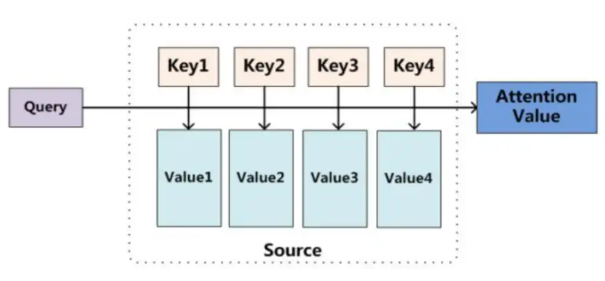

# 三、手撕注意力机制
## 1. Scaled Dot-Product Attention
**缩放点积注意力机制公式**：$$\text{Attention}(Q, K, V)=\text{softmax}\left(\frac{QK^T}{\sqrt{d_k}}\right)V$$


||意义|shape|
|-|-|-|
|Q|查询，表示当前位置需要去关注的信息|n×d|
|K|键，输入内容的特征表示，用于被匹配和检索|m×d|
|V|值，和键相对应，代表输入信息的实际内容|m×d|

> d是每条向量的元素数量

- $QK^T$.shape = n×m，每个元素都是一条查询向量和一条键向量的点乘，对应一条查询向量和一条键向量的**相似度得分**
- 除以$\sqrt{d_k}$的原因：进行缩放，防止点积值过大导致softmax梯度消失。
- softmax：将QK之间的相似度得分转换得到一个**概率分布**，即**注意力权重**，确保所有权重为正且和为1
- 最终输出：一个n×d的矩阵，其中每个输出向量是值向量的加权组合
- 自注意力机制 (Self-Attention)：特殊的Scaled Dot-Product Attention，把同一个输入序列 $X$ 同时映射出$Q、K、V$三组向量，然后做 Scaled Dot-Product Attention
  - $Q = XW_q$
  - $K = XW_k$
  - $V = XW_v$

```py
import torch
from torch import nn

class ScaledDotProductAttention(nn.Module):
    def __init__(self):
        super().__init__()
    def forward(self, Q, K, V, print_info=False):
        d_k = torch.tensor(K.shape[-1], device=K.device, dtype=K.dtype)
        # 因为要做矩阵乘法，所以K需要转置
        scores = torch.matmul(Q, K.transpose(-1, -2)) / torch.sqrt(d_k) # shape: [batch_size, seq_len_q, seq_len_k]
        probs = torch.softmax(scores, dim = -1)             # shape: [batch_size, seq_len_q, seq_len_k]
        attention = torch.matmul(probs, V)                  # shape: [batch_size, seq_len_q, hidden_size]
        if print_info:
            print(f"Q.shape: {Q.shape}")
            print(f"K.shape: {K.shape}")
            print(f"V.shape: {V.shape}")
            print(f"scores.shape: {scores.shape}")
            print(f"probs.shape: {probs.shape}")
            print(f"attention.shape: {attention.shape}")
        return attention

# test
batch_size = 8
seq_len_q = 128
seq_len_k = 256
seq_len_v = seq_len_k
hidden_size = 512

Q = torch.randn(batch_size, seq_len_q, hidden_size)
K = torch.randn(batch_size, seq_len_k, hidden_size)
V = torch.randn(batch_size, seq_len_v, hidden_size)

SDPA = ScaledDotProductAttention()
output = SDPA(Q, K, V, True)

'''
Q.shape: torch.Size([8, 128, 512])
K.shape: torch.Size([8, 256, 512])
V.shape: torch.Size([8, 256, 512])
scores.shape: torch.Size([8, 128, 256])
probs.shape: torch.Size([8, 128, 256])
attention.shape: torch.Size([8, 128, 512])
'''
```

## 2. Multi Head Attention（MHA）
**多头注意力中单个头的计算**: $$\text{head}_i=\text{Attention}(QW_i^Q, KW_i^K, VW_I^V)$$

- 将Q、K、V分别投影到不同的**子空间**
- 作用：让模型能够同时关注不同类型的特征关系
- 具体实现：
  - 对于$Q、K、V$，分别先用一个大矩阵（$W^Q$、$W^K$、$W^V$）进行线性变换
  - 然后将变换后的结果reshape成`[batch_size, seq_len, n_heads, d_k]`并调整维度顺序 (`d_k = hidden_size // n_heads`)
  - 该实现等价于使用`n_heads`个不同的投影矩阵（$W_i^Q$、$W_i^K$、$W_i^V$）进行变换，但计算更高效

**多头注意力的整体计算**: $$\text{MultiHead}(Q,K,V)=\text{Concat}(\text{head}_1,\cdots,\text{head}_h)W^O$$

- 将所有的头拼接起来，再通过线性变换$W^O$得到最终输出
- 拼接原因：
  - 每个头都学习到了输入序列的不同方面的表示
  - 不同头之间的信息是互补的
  - 拼接可以将这些多维度的信息整合到一个统一的表示中
- $W^O$ 线性变换原因：
  - 将拼接后的矩阵压缩到所需的输出维度
  - 学习如何最优地组合各个头的信息

**Attention中的dropout**：需要在softmax后，对$V$加权前执行

- 如果在softmax前执行dropout，执行完softmax可能产生**极端分布**
  - 例：`scores = [1.0, 2.0, 3.0]` $\rightarrow\text{dropout}\rightarrow$ `scores = [0, 2.0, 0]` $\rightarrow\text{softmax}\rightarrow$ `probs = [0, 1.0, 0]`
- 在softmax之后执行dropout，可以更好地防止过拟合，训练更稳定

**Attention中添加因果注意力掩码**：对scores进行掩码

- 用于自回归（AR）生成任务，确保当前位置只能看到之前位置的信息
- 具体实现：用上三角矩阵（不含主对角线）置为-1e9(或$-\infty$)
- 在encoder-decoder结构中，decoder的self-attention需要因果掩码，但cross-attention不需要

```py
import torch
from torch import nn
# 基于self-attention的MHA
class MultiHeadAttention(nn.Module):
    def __init__(self, n_heads, hidden_size, dropout_ratio = 0.1):
        super().__init__()
        self.n_heads = n_heads
        self.d_k = hidden_size // n_heads
        self.linear_q = nn.Linear(hidden_size, hidden_size) # W^Q
        self.linear_k = nn.Linear(hidden_size, hidden_size) # W^K
        self.linear_v = nn.Linear(hidden_size, hidden_size) # W^V
        self.linear_o = nn.Linear(hidden_size, hidden_size) # W^O
        self.dropout = nn.Dropout(p=dropout_ratio)
        
    def forward(self, input, causal_mask, apply_dropout=True, print_info=False):
        batch_size = input.shape[0]
        Q = self.linear_q(input)
        K = self.linear_k(input)
        V = self.linear_v(input)
        
        # 将大矩阵变换后的Q K V进行reshape（拆分出n_heads个head）
        # -1: 自动计算维度seq_len
        # transpose(1, 2): 交换维度，让n_heads在前，方便后续计算
        Q = Q.view(batch_size, -1, self.n_heads, self.d_k).transpose(1, 2)  # shape: [batch_size, n_heads, seq_len, d_k]
        K = K.view(batch_size, -1, self.n_heads, self.d_k).transpose(1, 2)  # shape: [batch_size, n_heads, seq_len, d_k]
        V = V.view(batch_size, -1, self.n_heads, self.d_k).transpose(1, 2)  # shape: [batch_size, n_heads, seq_len, d_k]
        
        scores = torch.matmul(Q, K.transpose(-1, -2)) / torch.sqrt(torch.tensor(self.d_k, device=Q.device, dtype=Q.dtype))  # shape: [batch_size, n_heads, seq_len, seq_len]
        
        if causal_mask is not None:
            # 调整causal_mask的维度以匹配scores, 方便之后广播
            causal_mask = causal_mask.unsqueeze(0).unsqueeze(0) # shape: [1, 1, seq_len, seq_len]
            # 让scores的上三角变得非常小，实现因果掩码
            # 确保每个位置只能注意到它自己和之前的位置，而不能看到未来的位置
            scores = scores.masked_fill(causal_mask, -1e9)
            if print_info:
                print(f"scores after causal_mask:\n{scores}")
        
        # 对每个查询位置的注意力分数进行softmax归一化
        probs = torch.softmax(scores, dim=-1)    # shape: [batch_size, n_heads, seq_len, seq_len]
        # 在softmax后执行dropout
        if apply_dropout:
            probs = self.dropout(probs)
        attention = torch.matmul(probs, V)       # shape: [batch_size, n_heads, seq_len, d_k]
        # Concat各个头
        attention = attention.transpose(1, 2).reshape(batch_size, -1, self.n_heads * self.d_k) # shape: [batch_size, seq_len, hidden_size]
        # 进行最终的线性变换
        attention = self.linear_o(attention)      # shape: [batch_size, seq_len, hidden_size]
        return attention

n_heads = 2
batch_size = 1
seq_len = 4
hidden_size = 16

# 产生一个 shape=(seq_len, seq_len) 的上三角矩阵
# diagonal = 1：保留主对角线之上的元素（不包括对角线），其余位置置为 0
causal_mask = torch.triu(torch.ones(seq_len, seq_len), diagonal=1).bool()

input = torch.randn(batch_size, seq_len, hidden_size)

MHA = MultiHeadAttention(n_heads, hidden_size)
output = MHA(input, causal_mask, apply_dropout=True, print_info=True)

'''
scores after causal_mask:
tensor([[[[ 9.9010e-01, -1.0000e+09, -1.0000e+09, -1.0000e+09],
          [ 3.2545e-02, -1.7282e-01, -1.0000e+09, -1.0000e+09],
          [ 6.3733e-01, -7.8881e-01, -1.6309e-01, -1.0000e+09],
          [-3.4773e-01,  1.8699e-01,  1.7318e-01,  4.7881e-01]],

         [[ 4.2123e-01, -1.0000e+09, -1.0000e+09, -1.0000e+09],
          [ 8.6634e-01,  2.2344e-01, -1.0000e+09, -1.0000e+09],
          [-1.5300e-01,  8.1691e-02,  5.1473e-01, -1.0000e+09],
          [ 3.3021e-01,  9.2300e-02,  2.2909e-03,  1.5585e-01]]]],
       grad_fn=<MaskedFillBackward0>)
'''
```