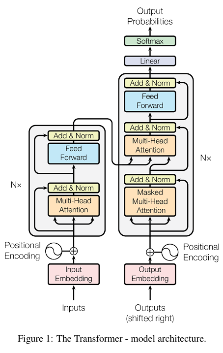

# 八、手撕Transformer


本章代码中Layer Normlization的位置使用 "[Attention Is All You Need](https://proceedings.neurips.cc/paper_files/paper/2017/file/3f5ee243547dee91fbd053c1c4a845aa-Paper.pdf)" 中最经典的 Post Norm：$$x_{t+1} = \text{Norm}(x_{t}+F_t(x_t))$$关于Pre Norm和Post Norm的差异已经在"[五、手撕归一化和正则化](https://zhuanlan.zhihu.com/p/1941315405210719817)"介绍。

位置编码使用出自 "[RoFormer: Enhanced Transformer with Rotary Position Embedding](https://arxiv.org/abs/2104.09864)" 的旋转位置编码（RoPE）。

前馈神经网络子层(FFN)的激活函数使用GeLU: $$\begin{aligned}\text{GeLU}(x) &= x \cdot \Phi(x)\\&\approx 0.5x\left(1 + \tanh\left(\sqrt{2/\pi}(x + 0.044715x^3)\right)\right)\end{aligned}$$

## 1. 核心组件实现
下面是核心组件 包括RoPE, MHA, Layer Norm, Dropout, GeLU, Linear, FFN, Embedding 的实现；这些组件已经在前几章进行详细介绍:

- RoPE: [手撕位置编码](https://zhuanlan.zhihu.com/p/1933614057816032698)
- MHA: [手撕注意力机制](https://zhuanlan.zhihu.com/p/1931817125980373592)
- Layer Norm, Dropout: [手撕归一化和正则化](https://zhuanlan.zhihu.com/p/1941315405210719817)
- GeLU: [手撕激活函数](https://zhuanlan.zhihu.com/p/1931808435873255820)
- Linear: [手撕线性层](https://zhuanlan.zhihu.com/p/1941317825613500636)
- Embedding: [手撕Embedding层](https://zhuanlan.zhihu.com/p/1945454321241138838)

```py
import torch
from torch import nn
import math
from typing import Tuple

# 基本组件：RoPE, MHA, LN, GeLU, FFN
# 计算旋转矩阵
def precompute_freqs_cis(dim: int, seq_len: int, theta: float = 10000.0):
    # 根据dim计算θi
    freqs = 1.0 / (theta ** (torch.arange(0, dim, 2)[: (dim // 2)].float() / dim))
    # 生成序列索引（0 ~ seq_len-1）
    t = torch.arange(seq_len, device=freqs.device)
    # torch.outer(): 计算两个向量的外积; 它会返回一个矩阵，其中每个元素是第一个向量的元素与第二个向量的元素的乘积。
    # 计算每个位置、每个频率对的最终旋转角度 m * θ_i
    freqs = torch.outer(t, freqs).float()  # shape = [seq_len, dim // 2]

    # torch.polar：根据极坐标（模长和角度），生成一个复数 e^(i * angle)
    # 每个复数的模长为1，由torch.ones_like提供
    # 角度为freqs = m * θ_i
    freqs_cis = torch.polar(torch.ones_like(freqs), freqs)   # shape = [seq_len, dim // 2]
    return freqs_cis

# 旋转位置编码计算
def apply_rotary_emb(
    xq: torch.Tensor,
    xk: torch.Tensor,
    freqs_cis: torch.Tensor,
) -> Tuple[torch.Tensor, torch.Tensor]:
    # input.shape: [batch_size, n_heads, seq_len, d_k]
    # 将d_k拆成d_k // 2 和 2
    xq_ = xq.float().reshape(*xq.shape[:-1], -1, 2) # shape = [batch_size, n_heads, seq_len, dim//2, 2]
    xk_ = xk.float().reshape(*xk.shape[:-1], -1, 2) # shape = [batch_size, n_heads, seq_len, dim//2, 2]
    
    # torch.view_as_complex将 [real, imag] 对转换为一个真正的复数
    # 例：[1, 2] -> 1 + 2j
    # shape: [B, H, S, D_k/2, 2] -> [B, H, S, D_k/2]
    # 维度虽然减少，但最后一个维度现在是complex64类型
    xq_ = torch.view_as_complex(xq_) # shape = [batch_size, n_heads, seq_len, dim//2]
    xk_ = torch.view_as_complex(xk_) # shape = [batch_size, n_heads, seq_len, dim//2]

    # torch.view_as_real 将旋转后的复数张量再转换回实数表示，shape:  [B, H, S, D_k/2] -> [B, H, S, D_k/2, 2]
    # .flatten(3): 从第3个维度开始展平，即把最后两个维度[d_k/2, 2]合并，恢复原始的 d_k 维度
    xq_out = torch.view_as_real(xq_ * freqs_cis).flatten(3) # shape = [batch_size, n_heads, seq_len, d_k]
    xk_out = torch.view_as_real(xk_ * freqs_cis).flatten(3) # shape = [batch_size, n_heads, seq_len, d_k]
    
    # 输出张量的数据类型与输入类型完全一致
    return xq_out.type_as(xq), xk_out.type_as(xk)

# 多头注意力机制
class MultiHeadAttention(nn.Module):
    def __init__(self, n_heads, d_model, max_seq_len=512, dropout_ratio=0.1):
        super().__init__()
        self.n_heads = n_heads
        self.d_model = d_model
        self.d_k = d_model // n_heads
        self.linear_q = nn.Linear(d_model, d_model)
        self.linear_k = nn.Linear(d_model, d_model)
        self.linear_v = nn.Linear(d_model, d_model)
        self.linear_o = nn.Linear(d_model, d_model)
        self.dropout = nn.Dropout(p=dropout_ratio)
        self.freqs_cis = precompute_freqs_cis(self.d_k, max_seq_len * 2)
         
    def forward(self, x, causal_mask=None, padding_mask=None):
        batch_size, seq_len , _ = x.shape
        
        Q = self.linear_q(x)    # shape: [batch_size, seq_len, d_model]
        K = self.linear_k(x)    # shape: [batch_size, seq_len, d_model]
        V = self.linear_v(x)    # shape: [batch_size, seq_len, d_model]
        
        # reshape并交换seq_len和n_heads两个维度
        Q = Q.view(batch_size, -1, self.n_heads, self.d_k).transpose(1, 2)  # shape: [batch_size, n_heads, seq_len, d_k]
        K = K.view(batch_size, -1, self.n_heads, self.d_k).transpose(1, 2)  # shape: [batch_size, n_heads, seq_len, d_k]
        V = V.view(batch_size, -1, self.n_heads, self.d_k).transpose(1, 2)  # shape: [batch_size, n_heads, seq_len, d_k]
        
        # 对Q和K应用旋转位置编码
        Q, K = apply_rotary_emb(Q, K, freqs_cis=self.freqs_cis[:seq_len].to(x.device))  # shape: [batch_size, n_heads, seq_len, d_k]
        
        # 计算attention scores
        scores = torch.matmul(Q, K.transpose(-1, -2)) / math.sqrt(self.d_k)    # shape: [batch_size, n_heads, seq_len, seq_len]

        if padding_mask is not None:
            mask = padding_mask.unsqueeze(1).unsqueeze(2)  # [batch_size, 1, 1, encoder_seq_len]
            scores = scores.masked_fill(~mask, -1e9)
        
        if causal_mask is not None:
            causal_mask = causal_mask.unsqueeze(0).unsqueeze(0)
            scores = scores.masked_fill(causal_mask, -1e9)    # shape: [batch_size, n_heads, seq_len, seq_len]
        
        probs = torch.softmax(scores, dim = -1)
        probs = self.dropout(probs)    # shape: [batch_size, n_heads, seq_len, seq_len]
        
        # 计算attention输出
        attention = torch.matmul(probs, V) # V不应用RoPE
        attention = attention.transpose(1, 2).reshape(batch_size, -1, self.n_heads * self.d_k)  # shape: [batch_size, seq_len, d_model]
        output = self.linear_o(attention)  # shape: [batch_size, seq_len, d_model]
        return output
    
# 交叉多头注意力机制
class MultiHeadCrossAttention(nn.Module):
    def __init__(self, n_heads, d_model, max_seq_len=512, dropout_ratio=0.1):
        super().__init__()
        self.n_heads = n_heads
        self.d_model = d_model
        self.d_k = d_model // n_heads
        self.linear_q = nn.Linear(d_model, d_model)
        self.linear_k = nn.Linear(d_model, d_model)
        self.linear_v = nn.Linear(d_model, d_model)
        self.linear_o = nn.Linear(d_model, d_model)
        self.dropout = nn.Dropout(p=dropout_ratio)
        self.freqs_cis = precompute_freqs_cis(self.d_k, max_seq_len * 2)
         
    def forward(self, decoder_x, encoder_output, encoder_attention_mask=None):
        batch_size, decoder_seq_len, _ = decoder_x.shape
        _, encoder_seq_len, _ = encoder_output.shape
        
        Q = self.linear_q(decoder_x)         # shape: [batch_size, decoder_seq_len, d_model]
        K = self.linear_k(encoder_output)    # shape: [batch_size, encoder_seq_len, d_model]
        V = self.linear_v(encoder_output)    # shape: [batch_size, encoder_seq_len, d_model]
        
        # reshape并交换seq_len和n_heads两个维度
        Q = Q.view(batch_size, -1, self.n_heads, self.d_k).transpose(1, 2)  # shape: [batch_size, n_heads, decoder_seq_len, d_k]
        K = K.view(batch_size, -1, self.n_heads, self.d_k).transpose(1, 2)  # shape: [batch_size, n_heads, encoder_seq_len, d_k]
        V = V.view(batch_size, -1, self.n_heads, self.d_k).transpose(1, 2)  # shape: [batch_size, n_heads, encoder_seq_len, d_k]
        
        # decoder的cross attention不额外注入位置编码
        
        # 计算attention scores
        scores = torch.matmul(Q, K.transpose(-1, -2)) / math.sqrt(self.d_k)    # shape: [batch_size, n_heads, decoder_seq_len, encoder_seq_len]
        
        # 使用encoder_attention_mask来mask掉encoder中的padding位置
        if encoder_attention_mask is not None:
            # encoder_attention_mask: [batch_size, encoder_seq_len] 
            # True表示有效位置，False表示padding位置
            # 需要扩展维度并取反（因为我们要mask掉False的位置）
            mask = encoder_attention_mask.unsqueeze(1).unsqueeze(2)  # [batch_size, 1, 1, encoder_seq_len]
            # mask = mask.bool()
            scores = scores.masked_fill(~mask, -1e9)
        
        probs = torch.softmax(scores, dim = -1)
        probs = self.dropout(probs)    # shape: [batch_size, n_heads, decoder_seq_len, encoder_seq_len]
        
        # 计算attention输出
        attention = torch.matmul(probs, V) # shape: [batch_size, n_heads, decoder_seq_len, d_k]
        attention = attention.transpose(1, 2).reshape(batch_size, -1, self.n_heads * self.d_k)  # shape: [batch_size, decoder_seq_len, d_model]
        output = self.linear_o(attention)  # shape: [batch_size, decoder_seq_len, d_model]
        return output

# LN
class LayerNormalization(nn.Module):
    def __init__(self, normalized_size, eps=1e-5, elementwise_affine=True):
        super().__init__()
        self.normalized_shape = normalized_size
        self.eps = eps
        self.elementwise_affine = elementwise_affine
        
        if self.elementwise_affine:
            # nn.Parameter: 可训练参数
            self.gamma = nn.Parameter(torch.ones(normalized_size))
            self.beta = nn.Parameter(torch.zeros(normalized_size))
        else:
            self.register_parameter('gamma', None)
            self.register_parameter('beta', None)
    
    def forward(self, x):   # 例：x.shape = [batch_size, seq_len, hidden_size]
        mu = x.mean(dim=-1, keepdim=True)                   # shape: [batch_size, seq_len, 1]
        # 计算总体方差而不是样本方差，所以unbiased=False
        var = x.var(dim=-1, keepdim=True, unbiased=False)   # shape: [batch_size, seq_len, 1]
        
        x_norm = (x - mu) / torch.sqrt(var+self.eps)
        if self.elementwise_affine:
            output = self.gamma * x_norm + self.beta
        else:
            output = x_norm
            
        return output                                      # shape: [batch_size, seq_len, 1]
    
# Dropout
class Dropout(nn.Module):
    def __init__(self, p=0.1):
        super().__init__()
        self.p = p
    def forward(self, x):
        if self.training:
            # torch.rand生成0~1的均匀分布，跟self.p比较就能生成掩码
            mask = (torch.rand(x.shape) > self.p).float()
            output = mask * x / (1 - self.p)
        else:
            output = x
        return output
    
# Tanh 和 GeLU
class Tanh(nn.Module):
    def __init__(self):
        super().__init__()
    def forward(self, x):
        return (torch.exp(x) - torch.exp(-x)) / (torch.exp(x) + torch.exp(-x))

class GeLU(nn.Module):
    def __init__(self):
        super().__init__()
        self.k = 0.044715
        self.tanh = Tanh()
    def forward(self, x):
        tanh = self.tanh(math.sqrt(2 / math.pi) * (x + self.k * x**3))
        return 0.5 * x * (1 + tanh)

# Linear
class Linear(nn.Module):
    def __init__(self, in_features, out_features, bias=True):
        super().__init__()
        self.in_features = in_features
        self.out_features = out_features
        self.weight = nn.Parameter(torch.empty(self.out_features, self.in_features))
        if bias:
            self.bias = nn.Parameter(torch.empty(self.out_features))
        else:
            self.register_parameter('bias', None)
        self.reset_parameters()
        
    def reset_parameters(self):
        nn.init.kaiming_uniform_(self.weight, a=math.sqrt(5))
        if self.bias is not None:
            fan_in, _ = nn.init._calculate_fan_in_and_fan_out(self.weight)
            bound = 1 / math.sqrt(fan_in)
            nn.init.uniform_(self.bias, -bound, bound)
    
    def forward(self, x):
        output = torch.matmul(x, self.weight.t())
        if self.bias is not None:
            output += self.bias
        return output

# FFN
class FeedForward(nn.Module):
    def __init__(self, hidden_size, ff_size, dropout_ratio=0.1):
        super().__init__()
        self.linear1 = Linear(hidden_size, ff_size)
        self.linear2 = Linear(ff_size, hidden_size)
        self.dropout = Dropout(p=dropout_ratio)
        self.gelu = GeLU()        
    def forward(self, x):
        x = self.linear1(x)
        x = self.gelu(x)
        x = self.linear2(x)
        output = self.dropout(x)
        return output
    
# Embedding
class Embedding(nn.Module):
    def __init__(self, num_embeddings, embedding_dim, padding_idx=None):
        super().__init__()
        self.num_embeddings = num_embeddings
        self.embedding_dim = embedding_dim
        self.padding_idx = padding_idx

        self.weight = nn.Parameter(torch.randn(num_embeddings, embedding_dim))
        if padding_idx is not None:
            with torch.no_grad():
                self.weight[padding_idx].fill_(0)
            # 注册梯度钩子来防止padding_idx位置的权重更新
            self.weight.register_hook(self._backward_hook)
        
        
    def _backward_hook(self, grad):
        if self.padding_idx is not None:
            grad[self.padding_idx].fill_(0)
        return grad
                
    def forward(self, x):
        if (x < 0).any() or (x >= self.num_embeddings).any():
            raise ValueError(f"indices must be in the range [0, {self.num_embeddings-1}]")
        # x.shape: [B, L]
        # 直接 fancy-indexing
        # output.shape: [B, L, embedding_dim]
        output = self.weight[x]
        
        return output
```

## 2. Transformer Encoder
Transformer Encoder一共有两个子层，分别是 **多头注意力子层** 和 **前馈神经网络子层**，每个子层都包含了 残差连接 和 层归一化。

```py
# Encoder Layer
class EncoderLayer(nn.Module):
    def __init__(self, 
                 hidden_size: int, 
                 num_heads: int, 
                 ff_size: int,
                 max_seq_len: int=512,  
                 dropout_ratio: float=0.1):
        super().__init__()
        self.mha = MultiHeadAttention(num_heads, hidden_size, max_seq_len)
        self.ffn = FeedForward(hidden_size, ff_size, dropout_ratio)
        self.ln1 = LayerNormalization(hidden_size)
        self.ln2 = LayerNormalization(hidden_size)
    def forward(self, x, src_padding_mask=None):
        # 多头注意力子层（Post Norm）
        attention_output = self.mha(x, padding_mask=src_padding_mask)
        x = self.ln1(x + attention_output)
        # 前馈神经网络子层（Post Norm）
        ffn_output = self.ffn(x)
        output = self.ln2(x + ffn_output)
        return output

# Encoder堆叠
class Encoder(nn.Module):
    def __init__(self,
                 num_layers: int,
                 hidden_size: int,
                 num_heads: int, 
                 ff_size: int,
                 max_seq_len: int=512,  
                 dropout_ratio: float=0.1):
        super().__init__()
        self.encoderlayers = nn.ModuleList([
            EncoderLayer(
                hidden_size, 
                num_heads, 
                ff_size, 
                max_seq_len, 
                dropout_ratio
            ) for _ in range(num_layers)
        ])
    def forward(self, x, src_padding_mask=None):
        for layer in self.encoderlayers:
            x = layer(x, src_padding_mask)
        return x

# 测试
n_layers=6
d_model=512
n_heads=8
d_ff=2048
max_seq_len=16
dropout_ratio=0.1
batch_size = 32
seq_len = max_seq_len

encoder = Encoder(
    n_layers,
    d_model,
    n_heads,
    d_ff,
    max_seq_len,
    dropout_ratio
)
x = torch.randn(batch_size, seq_len, d_model)

output = encoder(x)  # shape: [batch_size, seq_len, d_model]
print(output.shape)
print(f"output.shape == [batch_size, seq_len, d_model]: {list(output.shape) == [batch_size, seq_len, d_model]}")

'''
torch.Size([32, 16, 512])
output.shape == [batch_size, seq_len, d_model]: True
'''
```

## 3. Transformer Decoder
Transformer Decoder一共有三个子层，分别是 **掩码多头注意力子层**、**编码器-解码器注意力子层** 和 **前馈神经网络子层**，每个子层都包含了 残差连接 和 层归一化；

- **掩码多头注意力子层**使用了causal mask，用上三角矩阵实现，保证每个位置只能看见自己及之前的位置。
- **编码器-解码器注意力子层**的Q来自decoder上一个**掩码多头注意力子层**的输出，而K和V来自最后一个 encoder layer 的输出，这使得 Transformer Decoder 能够同时关注**当前输出序列的上下文信息（Q）** 和 **输入序列的编码信息（K、V）**。

```py
class DecoderLayer(nn.Module):
    def __init__(
        self,
        hidden_size: int,
        num_heads: int,
        max_seq_len: int,
        ff_size: int,
        dropout_ratio: float=0.1,
    ):
        super().__init__()
        self.self_attention = MultiHeadAttention(num_heads, hidden_size, max_seq_len, dropout_ratio)
        self.cross_attention = MultiHeadCrossAttention(num_heads, hidden_size, max_seq_len, dropout_ratio)
        self.ff = FeedForward(hidden_size, ff_size, dropout_ratio)
        self.ln1 = LayerNormalization(hidden_size)
        self.ln2 = LayerNormalization(hidden_size)
        self.ln3 = LayerNormalization(hidden_size)
    
    def forward(self, x, encoder_output, causal_mask=None, decoder_padding_mask=None, encoder_attention_mask=None):
        # self-attention
        self_attention_output = self.self_attention(x, causal_mask, decoder_padding_mask)
        x = self.ln1(x + self_attention_output)
        
        # cross-attention
        cross_attention_output = self.cross_attention(x, encoder_output, encoder_attention_mask)
        x = self.ln2(x + cross_attention_output)
        
        # feed forward
        ff_output = self.ff(x)
        output = self.ln3(x + ff_output)
        
        return output
    
class Decoder(nn.Module):
    def __init__(
        self,
        num_layers: int,
        hidden_size: int,
        num_heads: int, 
        ff_size: int,
        max_seq_len: int=512,  
        dropout_ratio: float=0.1
    ):
        super().__init__()
        self.decoderlayers = nn.ModuleList([
            DecoderLayer(
                hidden_size,
                num_heads,
                max_seq_len,
                ff_size,
                dropout_ratio
            ) for _ in range(0, num_layers)
        ])
    def forward(self, x, encoder_output, causal_mask=None, decoder_padding_mask=None, encoder_attention_mask=None):
        for layer in self.decoderlayers:
            x = layer(x, encoder_output, causal_mask, decoder_padding_mask, encoder_attention_mask)
        return x

# 测试
n_layers = 6
d_model = 512
n_heads = 8
d_ff = 2048
max_seq_len = 16
dropout_ratio = 0.1
batch_size = 32
tgt_seq_len = max_seq_len
src_seq_len = max_seq_len

decoder = Decoder(
    n_layers,
    d_model,
    n_heads,
    d_ff,
    max_seq_len,
    dropout_ratio
)

decoder_input = torch.randn(batch_size, tgt_seq_len, d_model)
encoder_output = torch.randn(batch_size, src_seq_len, d_model)

causal_mask = torch.triu(torch.ones(tgt_seq_len, tgt_seq_len), diagonal=1).bool()
# print(causal_mask)
encoder_attention_mask = torch.ones(batch_size, src_seq_len).bool()    # 这里其实不mask任何位置
decoder_attention_mask = torch.ones(batch_size, tgt_seq_len).bool()    # 这里其实不mask任何位置

decoder_output = decoder(
    decoder_input, 
    encoder_output, 
    causal_mask, 
    decoder_attention_mask,
    encoder_attention_mask
)

print(decoder_output.shape)
print(f"decoder_output.shape == [batch_size, tgt_seq_len, d_model]: {list(decoder_output.shape) == [batch_size, tgt_seq_len, d_model]}")

'''
torch.Size([32, 16, 512])
decoder_output.shape == [batch_size, tgt_seq_len, d_model]: True
'''
```

## 4. Transformer
组合Embedding, Encoder Block, Decoder Block 实现完整的Transformer，用于Seq2Seq任务（如机器翻译）

```py
class Transformer(nn.Module):
    def __init__(
        self, 
        src_vocab_size: int, 
        tgt_vocab_size: int, 
        hidden_size: int, 
        num_heads: int, 
        ff_size: int, 
        max_seq_len: int=512, 
        num_layers: int=6,
        padding_idx: int=0,
        dropout_ratio: float=0.1,
    ):
        super().__init__()
        self.src_embedding = Embedding(src_vocab_size, hidden_size, padding_idx)
        self.tgt_embedding = Embedding(tgt_vocab_size, hidden_size, padding_idx)
        self.encoder = Encoder(num_layers, hidden_size, num_heads, ff_size, max_seq_len, dropout_ratio)
        self.decoder = Decoder(num_layers, hidden_size, num_heads, ff_size, max_seq_len, dropout_ratio)
        self.output_proj = Linear(hidden_size, tgt_vocab_size)
        
        self.dropout = Dropout(dropout_ratio)
        self.padding_idx = padding_idx
        self.max_seq_len = max_seq_len

    def create_causal_mask(self, seq_len, device):
        return torch.triu(torch.ones(seq_len, seq_len, device=device), diagonal=1).bool()
    
    def create_padding_mask(self, x, pad_idx):
        return x != pad_idx
    
    def forward(self, ori_src, ori_tgt):
        """
        src.shape: [batch_size, src_seq_len]
        tgt.shape: [batch_size, tgt_seq_len]
        """
        batch_size, src_seq_len = ori_src.shape
        _ , tgt_seq_len = ori_tgt.shape
        
        # masking
        src_padding_mask = self.create_padding_mask(ori_src, self.padding_idx)
        tgt_padding_mask = self.create_padding_mask(ori_tgt, self.padding_idx)
        # decoder的self-attention层需要因果掩码
        tgt_causal_mask = self.create_causal_mask(tgt_seq_len, ori_tgt.device)
        
        # src encoding
        src_embed = self.src_embedding(ori_src)    # [batch_size, src_seq_len, hidden_size]
        src_embed = self.dropout(src_embed)
        encoder_output = self.encoder(src_embed, src_padding_mask)   # [batch_size, src_seq_len, hidden_size]
        
        # tgt decoding
        tgt_embed = self.tgt_embedding(ori_tgt)    # [batch_size, tgt_seq_len, hidden_size]
        tgt_embed = self.dropout(tgt_embed)
        decoder_output = self.decoder(             # [batch_size, tgt_seq_len, hidden_size]
            tgt_embed,
            encoder_output,
            tgt_causal_mask,
            tgt_padding_mask,
            src_padding_mask
        )
        
        # proj
        output = self.output_proj(decoder_output)  # [batch_size, tgt_seq_len, tgt_vocab_size]
        
        return output

# 测试
n_layers = 6
d_model = 512
n_heads = 8
d_ff = 2048
max_seq_len = 16
dropout_ratio = 0.1
batch_size = 32
tgt_seq_len = max_seq_len
src_seq_len = max_seq_len

vocab_size= 512

# source seq & target seq
src = torch.randint(0, vocab_size, (batch_size, src_seq_len))
tgt = torch.randint(0, vocab_size, (batch_size, tgt_seq_len))

myTransformer = Transformer(
    src_vocab_size=vocab_size,
    tgt_vocab_size=vocab_size,
    hidden_size=d_model,
    num_heads=n_heads,
    ff_size = d_ff,
    max_seq_len=max_seq_len,
    num_layers=n_layers,
    padding_idx=0,
    dropout_ratio=0.1
)

output = myTransformer(src, tgt)

print("Source Sequence shape:", src.shape)
print("Target Sequence shape:", tgt.shape)
print("Output shape:", output.shape)

'''
Source Sequence shape: torch.Size([32, 16])
Target Sequence shape: torch.Size([32, 16])
Output shape: torch.Size([32, 16, 512])
'''
```

>参考：
>1. [腾讯一面：写一下 Transformer Encoder](https://zhuanlan.zhihu.com/p/1928281717015287570?share_code=Gw2c3zxwoCpK&utm_psn=1934019025840636615)
>2. [手撕transformer算法（Encoder的搭建）](https://zhuanlan.zhihu.com/p/1918748624520738387)
>3. [手撕经典算法：Transformer篇](https://hwcoder.top/Manual-Coding-3)